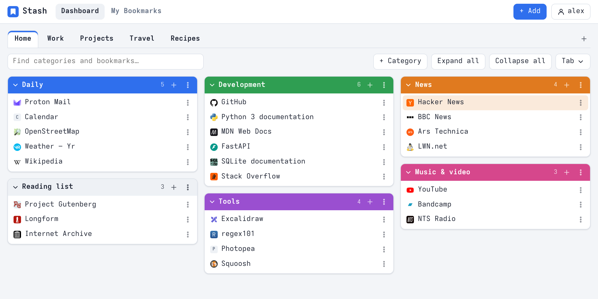
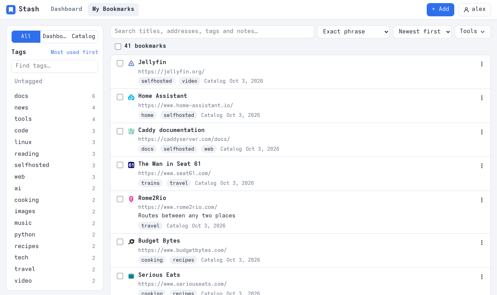

# Stash

A self-hosted bookmark manager you can use in the browser, from other computers through an API, and in
plain language from AI assistants such as Qwen Code or Claude Code through its MCP server.





<sub>Screenshots of a demo account (`node tools/screenshots.mjs` makes them again). A dark theme follows the
device setting.</sub>

**Everything stays in your hands.** Stash runs on your own server, and your bookmarks, browsing history and
change history live in your own database. You choose which language model, if any, gets to see them: point
your MCP client at a model on your own computer and no cloud service sees what you save, what you read or
what you ask. That is the big advantage of hosting it yourself: you get real use out of your browsing history
without handing it to anyone.

## What it consists of

1. **The server application** (`app/`, `static/`): a bookmark manager for the browser.
   - **Dashboard**: tabs with categories in columns and bookmarks inside them, arranged by dragging.
   - **Catalog**: a tagged store with fast search.
   - Import and export as a browser bookmarks file, sharing a tab by link, finding duplicates and dead links,
     a bookmarklet, a browser extension, two-factor authentication and invitation-based registration.
   - **Trash.** Deleted bookmarks wait 30 days in the trash (account menu → Trash), whichever way they were
     deleted: one at a time, many at once, with a whole category or tab, or through an API key. Every deletion
     shows an Undo button, and restoring puts a bookmark back where it was, making its category again if needed.
   - **Always current.** An open page redraws itself when the bookmarks change anywhere: in another tab or
     device, through an API key or MCP client, or in the background upkeep. It waits while you are typing, dragging
     or have a dialog open.
   - **Keeps titles and icons up to date.** In the background Stash gives unnamed bookmarks their page's real
     title and fetches site icons again (see *Background upkeep* below). Each account can switch this off.
   - The web UI and the browser extension speak **English, Finnish and Swedish** (Settings → Language, or the
     browser's language).
   - **API** (`/api/v1`) with API keys: all bookmarks at once, search, and changes with exact previews.
     Every change can be undone.
2. **An MCP endpoint** (`/mcp`, in `app/mcpserver/`) for AI assistants such as Claude Code, Qwen Code and
   Gemini CLI. You ask in plain language ("move everything about company X to tag Y", "check whether these
   links still work"); the assistant studies the bookmarks with Stash's tools, can read web pages and your
   browsing history, and previews every change as an exact dry run. Nothing changes until you agree to the
   preview, and everything can be undone. Nothing has to be installed: the assistant connects to your Stash
   with an API key (see *Using Stash from an AI assistant* below).
3. **Browsing history sync** (`scripts/stash-history-sync.py`): a small script (macOS and Linux, plain
   Python 3) that sends Firefox's visit counts to Stash every few hours. Then the assistant knows which bookmarks you
   really use: it can bring the most used ones to the Dashboard, order bookmarks and categories by use, find
   often visited pages that are not bookmarked yet, and suggest cleaning up the ones unused for years. The
   history is stored only on your own server, is never part of the bookmark export and can be deleted per
   device in Settings. Before sending, query parameters that often carry secrets (token, session, code, …) are
   removed, and whole sites can be left out.
4. **Link check with a local model** (`scripts/stash-linkcheck.py`): opens each bookmark in a headless Chromium
   on your own computer, clicks cookie banners and age confirmations away, and lets a model in Ollama decide
   whether the content still exists ("video removed", "not available", 404, a parked domain). It lists the
   gone ones and removes them through MCP only after you agree (see *Checking links with a local model*).

## Layout

| Path | Contents |
| --- | --- |
| `app/main.py` | FastAPI app: accounts, tabs, categories, bookmarks, search, sharing, import/export |
| `app/db.py` | SQLite schema and connections (`data/stash.db`, WAL) |
| `app/net.py` | Outgoing requests (dead links, titles, favicon cache), to public addresses only |
| `app/security.py` | Passwords (scrypt), sessions, TOTP, rate limiting |
| `app/api_v1.py` | `/api/v1` for API keys, plus managing keys and the change history |
| `app/history.py` | Browsing history sent by devices: upload, visit counts for bookmarks, search |
| `app/importer.py` | Reading and writing browser bookmark files (Netscape HTML) |
| `app/mcpserver/` | The MCP endpoint `/mcp`: its tools, named result sets, previews and page reading |
| `scripts/stash-history-sync.py` | Sends Firefox history to Stash (served at `/dl/stash-history-sync.py`) |
| `scripts/stash-linkcheck.py` | Finds bookmarks whose content is gone with a local model (served at `/dl/stash-linkcheck.py`) |
| `static/` | The web UI: native ES modules, no build step |
| `extension/` | Browser extension (downloadable from the app at `/extension.zip`) |
| `data/` | Database, favicon cache and `backups/`: not in version control |
| `scripts/backup.sh` | Hourly compressed copy of the database, 30 days kept (see *Backups*) |

## Running it

```sh
python -m venv .venv && .venv/bin/pip install -r requirements.txt
STASH_ORIGIN=https://stash.example.com .venv/bin/uvicorn app.main:app --host 127.0.0.1 --port 8003 --timeout-graceful-shutdown 5
```

Put a reverse proxy with HTTPS in front of it (for example Caddy or nginx). Open pages keep a server-sent events
stream (`/api/events`) open, so give uvicorn `--timeout-graceful-shutdown`: otherwise a restart waits for those
streams to end (they close and reconnect every five minutes). As a systemd user service:

```sh
systemctl --user status stash          # the service
systemctl --user restart stash         # after code changes (changes in static/ need no restart)
journalctl --user -u stash -f          # logs

.venv/bin/python -m app.cli invite                  # one-time invitation link (also needed for the first account)
.venv/bin/python -m app.cli users                   # accounts
.venv/bin/python -m app.cli reset-password NAME     # new random password, turns off 2FA
.venv/bin/python -m app.cli registration invite     # open | invite | closed
```

The first account is the administrator. By default you can only register with an invitation link; the
administrator creates invitations and changes the mode in Settings → Users and registration. To decide this in
the server configuration instead (for example in the systemd unit), set `STASH_REGISTRATION`:

| `STASH_REGISTRATION` | Who can create an account |
| --- | --- |
| `invite` | only people with an invitation link (the default when the variable is unset) |
| `open` | anyone, with just a username and a password: no email address or confirmation is needed |
| `closed` | nobody |

While the variable is set, the setting in Settings → Users and registration is shown but cannot be changed.

Environment variables: `STASH_ORIGIN` (public address), `STASH_DATA` (data directory, default `./data`),
`STASH_REGISTRATION` (see above), `STASH_MAINTENANCE` (`off` turns the background upkeep off; see below).

## Backups

`scripts/backup.sh` writes a consistent, zstd-compressed copy of the whole database (every account's bookmarks,
tabs, categories, tags, trash, settings and change history) to `data/backups/stash-YYYY-MM-DD_HHMM.db.zst`, checks
it with `PRAGMA integrity_check`, and deletes copies older than 30 days (`STASH_BACKUP_DAYS`). It is safe while
Stash runs. Run hourly, that is a version history of 720 copies, about 1 MB each for a few thousand bookmarks.
It needs `sqlite3` and `zstd`. As systemd user units:

```ini
# ~/.config/systemd/user/stash-backup.service
[Unit]
Description=Stash: database backup

[Service]
Type=oneshot
ExecStart=%h/stash/scripts/backup.sh

# ~/.config/systemd/user/stash-backup.timer
[Unit]
Description=Stash: database backup every hour

[Timer]
OnCalendar=hourly
Persistent=true

[Install]
WantedBy=timers.target
```

```sh
systemctl --user daemon-reload && systemctl --user enable --now stash-backup.timer
systemctl --user start stash-backup        # one backup now
ls data/backups/                           # the copies
```

The copies stay on the same disk, so also back up `data/` off the server (for example with restic).

To return the whole Stash to an earlier hour, stop it and put the copy in place:

```sh
systemctl --user stop stash
cp data/stash.db data/stash-before-restore.db
zstd -d -f data/backups/stash-2026-10-08_1100.db.zst -o data/stash.db && rm -f data/stash.db-wal data/stash.db-shm
systemctl --user start stash
```

To look at or take back only some bookmarks, open a copy beside the live database instead
(`zstd -d data/backups/… -o /tmp/old.db`, then `sqlite3 /tmp/old.db`).

## Using Stash from an AI assistant (MCP)

Stash is an MCP server at `https://<your stash>/mcp` (streamable HTTP). An assistant such as Claude Code, Qwen
Code or Gemini CLI connects to it with an API key and can then search, tidy and fix your bookmarks in plain
language. Nothing is installed on your computer.

The easy way is Settings → Assistant (MCP) → **Connect an assistant**: choose your assistant, and Stash creates a
key and shows the finished setup with the key in it. The same card explains how to use it, lists your keys with
their last use, lets you switch a key between read-only and read-and-change, revoke it, and write standing rules
for the assistant ("recipes always have the tag food").

The setups it shows, with your own address and key:

```sh
# Claude Code
claude mcp add --transport http stash https://stash.example.com/mcp --header "Authorization: Bearer stash_…"
```

```json
// Qwen Code (~/.qwen/settings.json) and Gemini CLI (~/.gemini/settings.json)
{ "mcpServers": { "stash": { "httpUrl": "https://stash.example.com/mcp",
                             "headers": { "Authorization": "Bearer stash_…" } } } }
```

Then ask, for example "which bookmarks about Python have no tags? suggest tags for them".

| Tool | What it does |
| --- | --- |
| `overview` | tags with counts, tabs and categories, the size of the collection, your rules, the sets made so far |
| `search` | finds bookmarks by words, regex, site, tags, tab, category, dates or use, and keeps them as a set (S1, S2, …) |
| `show`, `combine` | list a set; union, intersection or difference of two sets |
| `list_urls` | the whole addresses of a set as JSON with their tags and the tag vocabulary, for programs that open the pages themselves |
| `browsing_history` | visited addresses from your synced Firefox history, also those not bookmarked |
| `read_page` | reads one page as text |
| `check_links` | checks every link of a set: alive, moved, dead, unclear |
| `refresh_titles` | reads the pages' real titles and previews giving them to the bookmarks |
| `refresh_icons` | fetches the site icons again (a server cache, done at once) |
| `preview_changes` | runs changes as a dry run and returns the exact diff with a preview id (P1, P2, …) |
| `apply_changes` | applies a preview you agreed to |
| `recent_changes`, `undo` | the latest changes and taking one back |

How it stays safe:

- **Sets by name, not lists of ids.** Every search makes a set and changes refer to it by name. Stash expands
  names into ids itself, so the model cannot lose or invent bookmarks, and long lists never pass through it.
- **Preview, then apply.** `preview_changes` is an exact dry run. `apply_changes` only takes a preview id and
  runs the dry run once more first: if the bookmarks changed after the preview, nothing is applied. Keep
  `apply_changes` behind your assistant's confirmation prompt.
- **Undoable.** Every applied preview is one changeset (Settings → Changes made with API keys), and deleted
  bookmarks also wait 30 days in the trash.
- **Keys.** Each request needs an API key; a read-only key can look and preview but not apply. A key revoked in
  Settings stops working at once. The endpoint answers only for this server's own address.
- **Untrusted pages.** Page text and titles are data, never instructions. Pages are fetched by the server, never
  from its own addresses or private networks. A site that refuses the server's location cannot be read.

A key's sets and previews are kept in memory for an hour after its last use, so a conversation can build on them.

## The API

Other computers and programs use Stash at `/api/v1` with an API key (`Authorization: Bearer stash_…`).
Keys are created in Settings → Assistant (MCP); only a hash of the key is stored. A key can only read unless it is
allowed to make changes. `/api/v1` never accepts the session cookie, so it needs no CSRF header.

| Call | What it does |
| --- | --- |
| `GET /api/v1/me` | user, key name and rights, number of bookmarks |
| `GET /api/v1/snapshot` | all bookmarks at once + Dashboard structure + tags |
| `GET /api/v1/bookmarks?q=&tags=&mode=&host=&untagged=&scope=&ids=&limit=&offset=` | search (up to 1000 at a time) |
| `GET /api/v1/tags`, `GET /api/v1/structure` | tags with counts, tabs and categories |
| `POST /api/v1/changes` | `{"ops": [...], "summary": "...", "dry_run": true}`: changes in one transaction |
| `GET /api/v1/changes`, `POST /api/v1/changes/{id}/undo[?force=true]` | change history and undo |
| `POST /api/v1/favicons/refresh` | `{"ids": [...]}`: fetch the site icons of these bookmarks again, ignoring the cache (a key that can change; at most 60 sites per call) |
| `POST /api/v1/history/{device}` | `{"items": [...], "reset": true, "done": true}`: a device's browsing history (replaces its earlier one) |
| `GET /api/v1/history?q=&host=&min_visits=&period=&bookmarked=` | visited addresses, most visited first, with the bookmarks they match |
| `GET /api/v1/history/usage`, `GET /api/v1/history/sources`, `DELETE /api/v1/history/{device}` | visit counts of bookmarks, devices, deleting |

Operations: `add_tags`, `remove_tags`, `set_tags` (`ids`, `tags`), `rename_tag` (`old`, `new`; an empty `new`
removes the tag), `delete` (`ids`), `move` (`ids` + `category_id`, or `tab` + `category` which are created when
missing, or `catalog: true`), `update` (`id` + `title`/`url`/`notes`/`color`/`tags`), `create` (`url`, `title`,
`tags`, a place as for `move`), `order_bookmarks` (a category's bookmarks in the given order) and
`order_categories` (a tab's categories in order, each within its column). `dry_run` runs the operations and
rolls them back, so the preview (`diff`: each bookmark's tags, place, position and fields before and after) is
exactly what would happen. A real run stores a changeset (the latest 200) with the earlier state of every
touched bookmark and category; undoing it restores them, brings deleted bookmarks back and removes added ones.
If a later change touched the same bookmarks, undo needs `force=true`. Changes can also be seen and undone in
Settings → Changes made with API keys.

Site icons are a cache shared by all accounts. A refresh fetches only sites the caller has bookmarked, never
replaces a working icon with a failure, and changes the icon version the web UI loads icons with, so browsers
show a new icon at once instead of keeping their week-long cached copy.

## Background upkeep

A slow loop inside the server works through a small batch every few minutes. A bookmark whose title is empty or
just its own address is given the page's real title, and site icons are fetched again. A title you have written
is left untouched, and a page the server cannot reach keeps whatever title it already has. The loop also empties
the trash of what has been there longer than 30 days.

These edits are made directly, so they do not fill the undo history. Each account can turn this off in
Settings → Bookmarks, and `STASH_MAINTENANCE=off` disables it for the whole server. Duplicates and dead links are
found when you ask: My Bookmarks → Tools, or your assistant.

Browsing history is matched to bookmarks loosely (http/https, `www.` and a trailing slash do not matter). Each
device sends visit counts per address (last 30, 90 and 365 days, and all), and a new sync replaces that
device's earlier rows.

Sending the history from the Mac (or Linux computer) where Firefox is used:

```sh
curl -o ~/stash-history-sync.py https://stash.example.com/dl/stash-history-sync.py
python3 ~/stash-history-sync.py --setup       # Stash address, a key (Settings → Browsing history → Create a key
                                              # for this computer), a name for this computer
python3 ~/stash-history-sync.py --dry-run     # shows what would be sent
python3 ~/stash-history-sync.py --schedule    # sends every 6 hours (launchd / cron)
```

## Checking links with a local model

The server's own link check sees only status codes. A video page that answers 200 but says "video unavailable",
a page hidden behind a cookie or age wall, or a domain now selling something else needs a browser and someone to
read the page. `scripts/stash-linkcheck.py` does that on your own computer with a local model in Ollama (default
`gemma4:e4b-128k`; any model with `--model`):

1. It asks Stash over MCP for the bookmarks (all, or `--tag`, `--host`, `--text`, `--tab`, `--where`).
2. Each page is opened in a headless Chromium, a few at a time. Cookie banners and age confirmations are
   answered like a person would; pictures and video are not downloaded.
3. The model gets the status, redirects, final address, title, headings, the start of the text and a video
   player's own status, and answers *exists*, *gone* or *unsure* with a short reason. Logins, captchas, blocks
   and timeouts are *unsure* and never offered for removal.
4. The gone ones are listed with their reasons. You answer: remove all, none, or keep the ids you name. The
   removal is one Stash change through `preview_changes` and `apply_changes`: undoable, and the bookmarks wait
   30 days in the trash.
5. For the pages that exist, the same answer holds the tags that fit them. The model sees the bookmark's
   current tags and the tags you use (with counts), keeps the tags that still fit, adds fitting ones from your own
   vocabulary (a new tag only when none fits) and drops the ones that clearly do not or that duplicate a better
   tag. The changes are printed and applied as one undoable Stash change without asking. Unreadable pages
   ("unsure") are never retagged. For a video, recording or gallery page it tags what the content is about (genre,
   topic, the people named, the setting), up to 8 tags, so the item can be found by what it shows. `--no-tags`
   leaves the tags alone and `--tag-language Finnish` (or any language) makes new tags come in that language (the model names the language of each tag it adds, and a new tag in another language is dropped).

```sh
sudo pacman -S --needed python chromium ollama      # Arch; Ollama also from ollama.com
ollama pull gemma4:e4b-128k
python -m venv ~/.local/share/stash-linkcheck
~/.local/share/stash-linkcheck/bin/pip install playwright
curl -o ~/stash-linkcheck.py https://stash.example.com/dl/stash-linkcheck.py
~/.local/share/stash-linkcheck/bin/python ~/stash-linkcheck.py --setup    # Stash address and an API key
~/.local/share/stash-linkcheck/bin/python ~/stash-linkcheck.py            # check, list, ask, remove
```

The key comes from Settings → Assistant (MCP) → Create a key for a program, with "Allow changes" (a read-only key
can check and list but not remove). The verdicts are saved in `~/.cache/stash/linkcheck-report.json`;
`--resume` reuses them and checks only the rest, `--no-delete` only skips the removal (tags are still put in order), `--no-tags` skips the tagging, `--show-browser` shows the window.

## Tests

```sh
.venv/bin/python tests/smoke.py    # the web API end to end, throwaway database
.venv/bin/python tests/api_v1.py   # API keys, /api/v1, previews and undo
.venv/bin/python tests/history.py  # the sync script against a fake Firefox profile, the history API, ordering
.venv/bin/python tests/trash.py    # the trash: every way of deleting, restoring, the 30-day limit
.venv/bin/python tests/maintenance.py  # the background upkeep of titles and icons
.venv/bin/python -m pytest -q tests/mcp    # the MCP tools and /mcp end to end (pip install pytest)
node tests/ui.mjs                  # headless Chromium, its own server on port 8013, screenshots in data/tmp/
node tools/check-i18n.mjs          # missing or broken Finnish and Swedish translations
node tools/screenshots.mjs         # the README screenshots, from a demo instance on port 8014
```

## Languages

UI strings are written in English in the code (`t('…')`); `static/js/i18n.js` maps them to Finnish and
`static/js/i18n-sv.js` to Swedish, and `extension/_locales/` holds the extension's texts. A new string needs
both translations, which `node tools/check-i18n.mjs` checks (placeholders such as `{n}` included). The
repository, the API, the MCP tools and the scripts are in English only.

## Security in brief

- The session cookie is `HttpOnly; Secure; SameSite=Lax`; every state-changing call of the web API needs the
  `X-Stash` header (CSRF).
- The CSP allows only same-origin scripts and styles; bookmark addresses may be http(s), ftp, mailto and tel.
- Requests made by the server resolve the target first and refuse internal network and localhost addresses.
- The bookmarklet and the extension pass page details in the URL's `#` part, which never reaches server logs;
  configure the reverse proxy to log without query strings and cookies.
- API keys and the browsing history belong to one account and are deleted with it.
